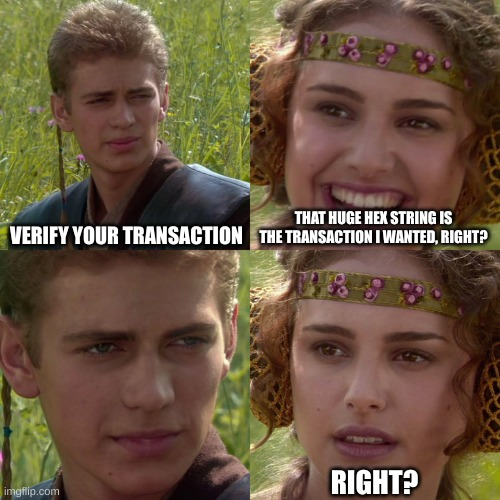

import MartinsTweet from "./MartinsTweet"

The $1.5B Bybit hack has reignited one of the most fundamental vulnerabilities in crypto security: **blind signing**. When users approve transactions on their hardware wallets, they're often shown an indecipherable blob of hex data. They're trusting that the front-end they used to prepare the transaction is showing them the same reality they're about to sign.

In Bybit's case, that trust was catastrophically misplaced. It's time to rethink how we verify transactions — starting with how we leverage hardware wallets, and ultimately by introducing a new paradigm we call **"multi-sim"**.

## Blind Signing: The Bybit Wake-Up Call

On February 21, 2025, attackers drained approximately $1.5 billion worth of assets \*\*\*\*in what is now the [largest cryptocurrency hack ever — and the biggest theft in recorded history](https://www.elliptic.co/blog/bybit-hack-largest-in-history), surpassing the $1 billion stolen from the Central Bank of Iraq in 2003.

The attackers exploited a compromised Safe\{Wallet\} web app interface, tricking users into blindly signing malicious transactions on their hardware wallets. These signatures allowed the attackers to seize control of targeted Safe accounts \*\*\*\*and drain all associated assets.

The attack has been [attributed](https://www.ic3.gov/PSA/2025/PSA250226) to North Korean state-backed hackers, who have been linked to a long string of high-profile exploits. This includes the [$50 million Radiant hack](https://medium.com/@RadiantCapital/radiant-capital-incident-update-e56d8c23829e), where, once again, blind signing was the critical failure.

Recent hacks have made one thing clear: the biggest vulnerabilities no longer lie in smart contracts themselves, but in the interfaces and practices we rely on to interact with them. Tactics include:

- **DNS Hijacking & Phishing:** Directing users to fake frontends.
- **App Supply Chain Attacks:** Injecting malicious code into trusted apps via upstream dependencies.
- **Compromised End-User Devices:** Even with clean apps, malware on users' machines can manipulate what they see.
- **Social Engineering:** Manipulating people into divulging sensitive information or performing sensitive actions that compromise security, often through deception, trust exploitation, or impersonation.

In short, we cannot fully trust any interface, any machine, or even our own eyes. Yet, we can't let total paranoia paralyze our ability to transact. The question becomes:

**Where do we place trust?**

---

## Hardware Wallets: The Last Line of Defense — But Barely Usable

Hardware wallets — such as Ledger, Trezor, Keystone, and GridPlus — have one crucial advantage: they are airgapped, dedicated devices designed with minimal dependencies. They derive their security from their fundamental simplicity, isolating private keys from the internet and presenting transaction details on a physically separated screen. This makes the hardware wallet the **final reality check.** The transaction you approve on a hardware wallet should be the real one, immune to tampering by compromised apps or malware.

### Are you sure you want to 0x8fa05ec47… ?

But in practice, hardware wallets have poor usability: they mostly display raw hex blobs when asking for your approval. A typical user is shown pages of meaningless data — hashes, byte arrays, and opaque payloads — offering no practical way to verify what they're signing.

This is exactly why users rely on less secure front-ends to decode and explain transactions to them. They trust the web app to tell them: who they're interacting with, which tokens are being transferred, and what approvals are being granted. But when those front-ends are compromised — like in the Bybit hack — this blind reliance becomes catastrophic.

<MartinsTweet />

### Manual Cross-Checking 🥵

Some highly security-conscious users try to protect themselves using manual cross-checking. They might:

- Use multiple front-ends to prepare and inspect the same transaction.
- Review the payload on a separate, secure laptop that's kept offline or used only for high-value transactions.
- Compare the payloads and hashes across both devices, ensuring they match before signing on their hardware wallet.

While this process offers some protection, it's completely impractical for most users — and clearly was too much to ask even of Bybit's operators handling billions in assets. Not every protocol has multiple front-ends, and asking most users to maintain a dedicated, clean machine just for signing is unrealistic.

Why don't hardware wallets present transactions in a more readable way, sparing us from comparing raw hashes against less secure front-ends? Current generation devices have screens large enough for proper review, but the real issue is context. Airgapped by design, they lack access to block explorers and RPC endpoints required to decode and simulate transactions. This leaves them blind — reduced to displaying raw hex — unless we can feed them trustworthy data from outside sources.

That's exactly what **Multi-Sim** is designed to solve.

---

## Multi-Sim: A New Way to Verify Transactions

Multi-Sim introduces distributed trust to transaction decoding and simulation, allowing hardware wallets to display clear, human-readable transaction summaries — without compromising their isolation.

The concept is simple: instead of relying on a single decoding and simulation service, we use multiple independent services, each operated by a different provider. Each of these services:

1. **Decode** the transaction payload using the relevant smart contract ABIs.
2. **Simulate** the transaction on a current blockchain state fork, revealing emitted events and state changes.
3. **Compile a standardized report** with the decoded transaction and the simulation results.
4. **Cryptographically sign** the report so the hardware wallet can verify its authenticity.

The user's desktop wallet interface collects these reports and forwards them to the hardware wallet, which:

- **Verifies signatures** of all reports .
- **Cross-checks** the content for consistency across all reports.
- Presents a final, **human-readable summary** to the user, showing the decoded calls, token flows, events, and state changes.

## Deriving Security from Redundancy

The power of multi-sim comes from redundancy. Compromising one provider? Difficult. Compromising all four, simultaneously, without detection? Exponentially harder.

This is the same logic that makes multi-sig wallets so secure — distributed trust across independent parties. By distributing the decoding and simulation work across independent, professionally managed providers, we dramatically reduce the odds of blind signing malicious transactions.

**Multi-Sim Automates What The Paranoid Do Manually**

Instead of asking users to maintain a secondary device or manually cross-check transactions across multiple front-ends, multi-sim automates the process at the infrastructure level.

1. The user interacts with a single front-end.

2. The multi-sim network — made up of independent, professional providers — acts as the redundant reality check.

3. The hardware wallet becomes the final checkpoint, ensuring all multi-sim reports match before presenting a clear, human-readable summary to the user.

This brings the benefits of **multi-factor, multi-viewpoint security** — without requiring every user to become their own security engineer.

## Call to Action: Let's Build Multi-Sim Together

We're actively building **Zodiac Pilot** to become the most powerful and secure transaction builder in the Ethereum ecosystem. But the ultimate weak point remains: the signing step.

Blind signing is unacceptable. We call on all developers, hardware wallet vendors, and infrastructure providers to work with us to:

- Define an **open standard for transaction verification reports**.
- Create **a diverse, resilient network of multi-sim providers**.
- Integrate multi-sim verification into hardware wallets and transaction builders

With **multi-sim**, we can turn blind signing it into crystal-clear transaction verification — making blockchain interactions more secure for everyone.
