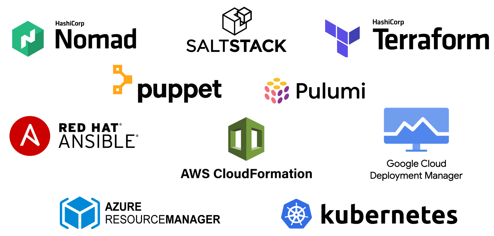
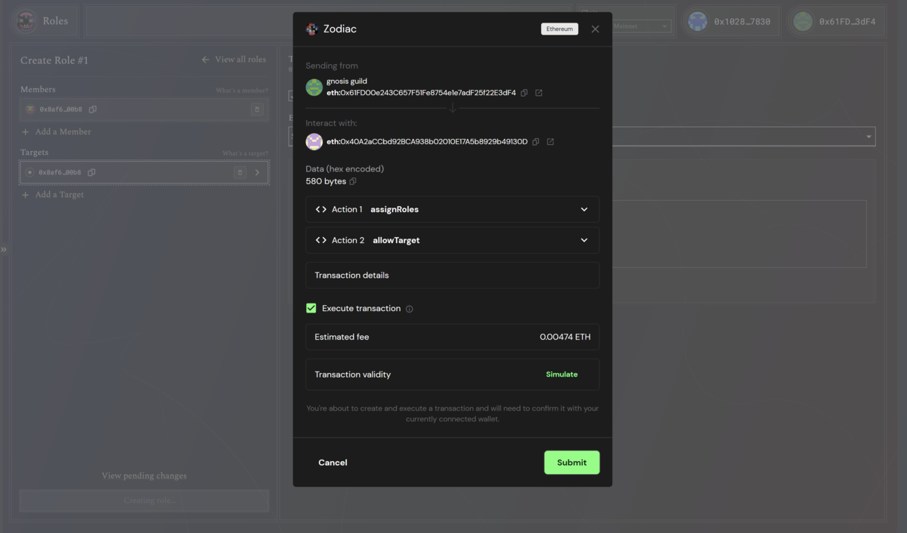
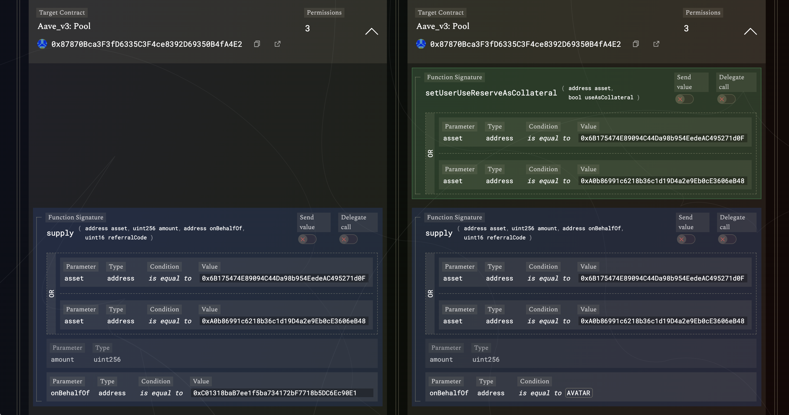
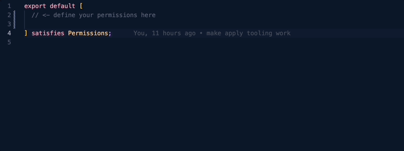

**With the [recent version 2 release of the Zodiac Roles Modifier](https://gnosisguild.mirror.xyz/oQcy_c62huwNkFS0cMIxXwQzrfG0ESQax8EBc_tWwwk) we are introducing "Permissions as Code", an evolutionary approach to managing roles and permissions in a similar vein to Infrastructure as Code. Roles v2 allows you to define the configuration of your roles as declarative statements in code, enhancing efficiency, reproducibility, and transparency.**

## The Rise of "Infrastructure as Code"

Infrastructure as Code (IaC) has been one of the most significant evolutions in the computing space over the last decade. It has dramatically transformed the way we manage and provision computing resources, allowing teams to automate processes that were once manual and error-prone. With IaC, infrastructure is defined and managed using code, meaning it can be version controlled, shared, and reused, just like any other software code. This not only increases efficiency and speed, but also improves reliability, consistency, and visibility into infrastructure changes.

To make this more tangible, consider a system administrator who would traditionally run shell commands and use graphical console interfaces to configure different environments. With Infrastructure as Code, this process is transformed. The administrator is no longer manually inputting commands. Instead, they apply a configuration that is declaratively defined in code to a given environment. This automates away the tedious and error-prone manual diffing work. It provides a standardized and repeatable mechanism for provisioning infrastructure, reducing errors and inconsistencies caused by manual processes.

<figure>
  

  <figcaption>Popular Infrastructure as Code products</figcaption>
</figure>

## Issues Managing Onchain Permissions

The Zodiac Roles Modifier is a groundbreaking onchain permissions module designed to transform the way smart accounts interact within decentralized ecosystems. It empowers onchain entities to extend secure transaction permissions to any account through customizable roles.

Upon closer examination, the steps required to manage roles permissions are similar in essence to those used in provisioning computer infrastructure:

- Upfront, the existing roles configuration is replicated to a testing environment, e.g., through forking the host blockchain or by manually creating a clone of the production Roles mod.
- The new permissions are applied through contract calls to the Roles mod test replica. They are modified until tests confirm their correctness.
- Permission update calls now need to be applied in the exact same sequence to the production Roles mod.

Several issues can arise in the steps described above. For instance, the manually created test environment may not perfectly replicate the production Roles mod. Mistakes in the sequence of applying permission update calls could lead to errors or inconsistencies. In general, the need for manual intervention in applying changes can introduce human error and hampers reproducibility and transparency of the entire process.

<figure>
  

  <figcaption>Managing permissions in the Roles v1 app</figcaption>
</figure>

## Introducing “Permissions as Code”

Roles v1 enabled a manual approach to configuring permissions, either through the Roles app or via direct contract calls. As the next step of evolution, Roles v2 is designed with a “Permissions as Code” approach in mind, redefining how you can manage and assign roles and permissions. You define the desired state of your Roles mod configuration in a declarative manner, and the tooling takes care of enforcing it. In essence, roles and permissions become declarative statements in code, which can be version controlled, automated, and audited just like infrastructure setups.

This becomes possible through powerful capabilities incorporated into the Roles v2 toolset: The ability to see differences between permission sets allows for quick identification of changes needed, while automated configuration patching functions assist in applying these changes in a consistent and efficient manner. Intuitive interfaces ensure a high level of transparency throughout the process, enabling you to have full control and understanding of the state of your permissions at all times.

<figure>
  

  <figcaption>
    Permissions diff view in the {/* prettier-ignore */}
    <a href="https://roles.gnosisguild.org/eth:0xbd1099dfd3c11b65fb4bb19a350da2f5b61efb0d/roles/BALANCER-MANAGER/diff/SCIiCKTqBARP5AYeaioUhol6UMEJqcZZq9qpMIu84?annotations=false">Roles v2 app</a>
  </figcaption>
</figure>

## Getting Started

Though the thought of writing code might seem daunting to those without a technical background, an approachable method awaits you in our [permissions-starter-kit](https://github.com/gnosisguild/permissions-starter-kit). Use this template to create your own repository for roles permissions and apply them to any Roles mod with a simple command.

A code editor, such as [VSCode](https://code.visualstudio.com), can greatly assist you in authoring permissions by providing automatic suggestions and performing correctness checks based on contract ABIs as you type.

<figure>
  

  <figcaption>
    Permissions auto-completion based on target contracts’ ABI
  </figcaption>
</figure>

Finally, by executing a single command, you apply the defined permissions to the specified Roles mod. This action triggers your browser to open an interface in the Roles app that displays the differences between the current configuration of the Roles mod and the desired target state defined in your permissions code repository. After verifying that everything aligns with your expectations, you can click the “Execute” button to initiate the update transaction.

## What Lies Ahead

Engineers, often the first to implement automation and leverage it for their own development workflows, are at the forefront of tooling. This has propelled the code tooling landscape far ahead of software designed for less technical audiences. The elegance of "Permissions as Code" is its ability to harness these mature and powerful tools. For instance, Git can be utilized for version control, while GitHub or [Radicle](https://radicle.xyz) offer platforms for teamwork and collaboration. Taking the next step, Continuous Integration (CI) tools can be deployed to automate permission management workflows in a [GitOps](https://about.gitlab.com/topics/gitops/gitops-workflow/) fashion.

In embracing the power of the open-source movement, we will be able fork permission repositories, building upon the foundations laid by others. With initiatives like [DeFi Kit](https://kit.karpatkey.com) we have the chance to collaboratively shape libraries of robust permissions. This collective effort helps us keep pace with the rapid evolution of the ecosystem while ensuring that all permissions undergo thorough scrutiny and refinement. Let's unite to pave secure pathways for transacting within our ever-expanding decentralized ecosystem!

---

**A huge shout-out to the [Karpatkey](https://www.karpatkey.com) team for their invaluable partnership in pioneering the Permissions as Code approach. Their early user feedback and relentless pursuit of operational efficiency have been instrumental in shaping the Zodiac Roles Modifier toolset.**
